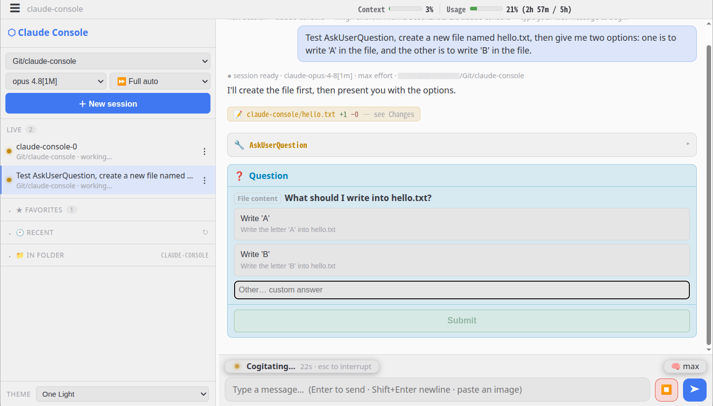
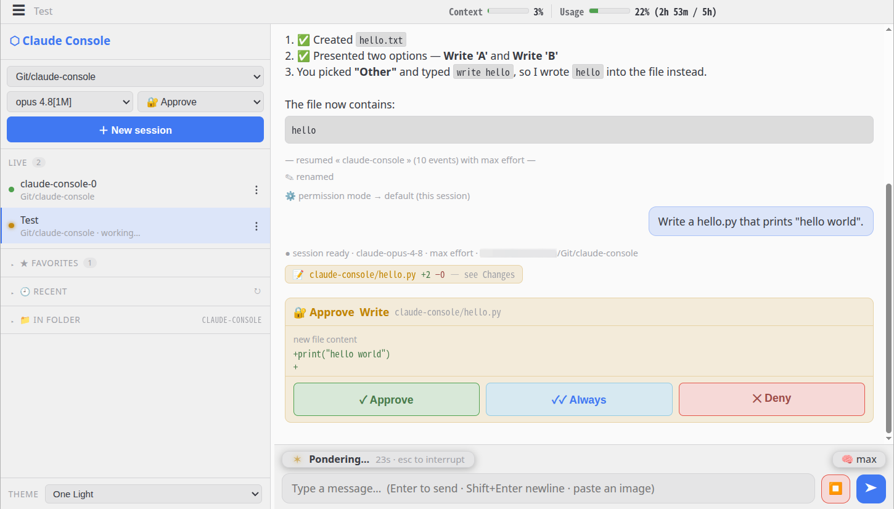
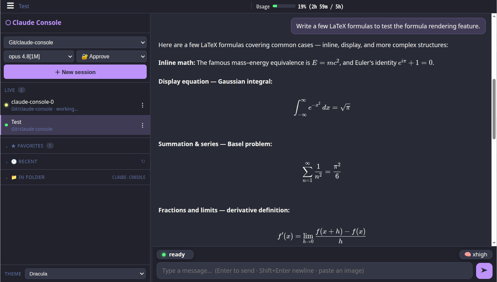

# Claude Console

An interactive, browser-driven GUI for **Claude Code** that separates the two
things a raw terminal tangles together:

- **Discussion** — what you asked / what the agent said (prose only)
- **Code & file changes** — every tool call (edits, writes, commands) rendered as
  **collapsed cards** (`✏️ Edit server.py  +12 −3`) you expand on demand, plus the
  live `git diff` of the working directory (ground truth)

<p align="center">
  
  
</p>
<p align="center">
  
</p>

It drives Claude Code through the **Claude Agent SDK** (which runs the real
`claude` CLI in headless stream-json mode), keeps one process alive per chat,
feeds your messages on stdin, and renders the typed event stream back — a
Claude-Code-style chat where code and conversation stay visually separated,
which is the whole point.

## Features

- **Chat / code split** — prose in the stream; tool calls as collapsible change
  cards. Click **see Changes** on any edit to open the drawer focused on *just
  that file*, or switch to the live **Git diff** tab for the whole working tree.
- **Multi-session sidebar** — Live / Favorites / Recent / In-folder sections
  (each collapsible). Each card has a `⋮` menu: rename, favorite, delete, end.
  Drag the sidebar's right edge to resize (double-click to reset).
- **Resumable sessions** — reopen a project and pick up a previous Claude Code
  conversation (transcripts under `~/.claude/projects` restore history and the
  right `cwd`).
- **Interactive round-trips** — per-action approval with three choices
  (**Approve** / **Approve & don't ask again this session** / **Deny**) in 🔐
  Approve mode, plus in-browser **AskUserQuestion** cards; your pick is fed back
  to the agent.
- **Message queue** — type while the agent is busy and the message queues; it is
  injected into the running turn at the next tool boundary (steering). Click a
  queued chip (or press ↑) to withdraw it back into the editor and edit it.
- **Thinking effort** — a `🧠` pill (low / medium / high / xhigh / max) to set
  reasoning depth, switchable on the fly (the session relaunches with the new
  `--effort`).
- **Image paste** — paste a screenshot (`Ctrl/Cmd+V`) into the composer to send
  it as a multimodal message.
- **LaTeX rendering** — `$…$`, `$$…$$`, `\(…\)`, `\[…\]` in replies render with
  KaTeX (vendored, offline).
- **13 color themes** — light & dark (Dark, Dracula, Nord, Tokyo Night,
  Catppuccin, Gruvbox, Light, Solarized Light, Rosé Pine Dawn, One Light, Ayu
  Light, …), switchable from the sidebar; choice persists per device.
- **At-a-glance status** — context-window and rolling 5-hour usage meters in the
  header; a floating status pill (ready / working timer) plus the effort pill
  above a full-width composer.
- Pick **project dir**, **model** (default/opus/sonnet/haiku) and **permission
  mode** when starting a session.

## Run

```bash
# any python with tornado + claude-agent-sdk works; defaults to localhost-only (safe):
python server.py

# to reach it from your phone/iPad on the LAN, expose it WITH auth:
CLAUDE_CONSOLE_BIND=0.0.0.0 CLAUDE_CONSOLE_AUTH=me:secret python server.py
```

Open `http://<host>:7703`, pick a project dir, and start chatting; the change
cards and the **Git diff** drawer update live as the agent works.

| Env | Default | Meaning |
|---|---|---|
| `CLAUDE_CONSOLE_PORT` | `7703` | listen port |
| `CLAUDE_CONSOLE_BIND` | `127.0.0.1` | bind address; set `0.0.0.0` for LAN access |
| `CLAUDE_CONSOLE_AUTH` | *(disabled)* | optional HTTP Basic Auth `user:pass` |

The legacy `AGENTLENS_*` names are still honored as a fallback.

> [!WARNING]
> This **drives Claude Code** in the directory you pick — it can read/write files
> and run commands there — and it exposes your **chat history and source diffs**.
> Do not expose it on an untrusted network without `CLAUDE_CONSOLE_AUTH` and a
> trusted boundary (VPN / SSH tunnel / reverse proxy + TLS).

## Notes

- Intentionally a single `server.py` with inline HTML/CSS/JS — **no build step**.
- [KaTeX](https://katex.org/) is vendored under `static/katex/` (MIT) for offline
  math rendering.

## License

[MIT](LICENSE) © 2026 BoZhen
