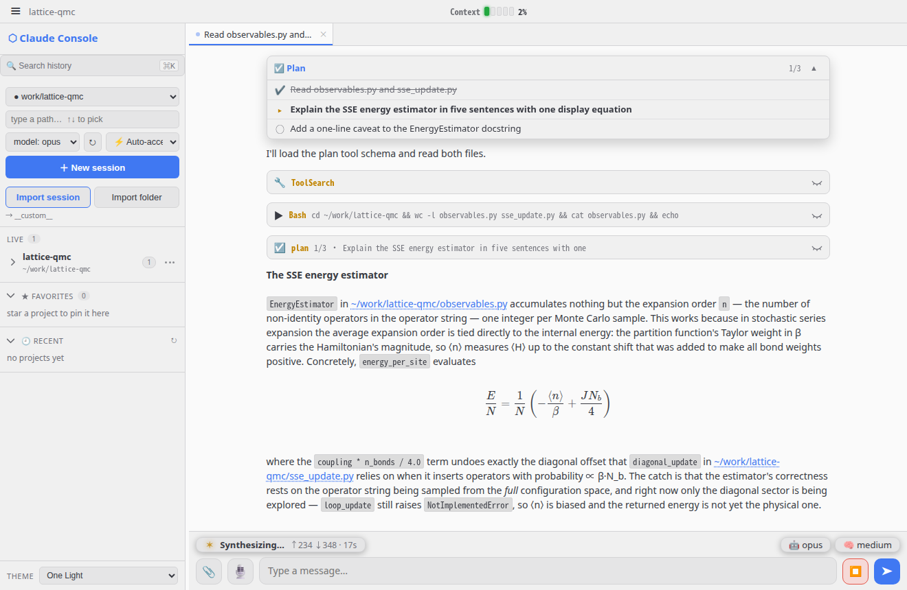
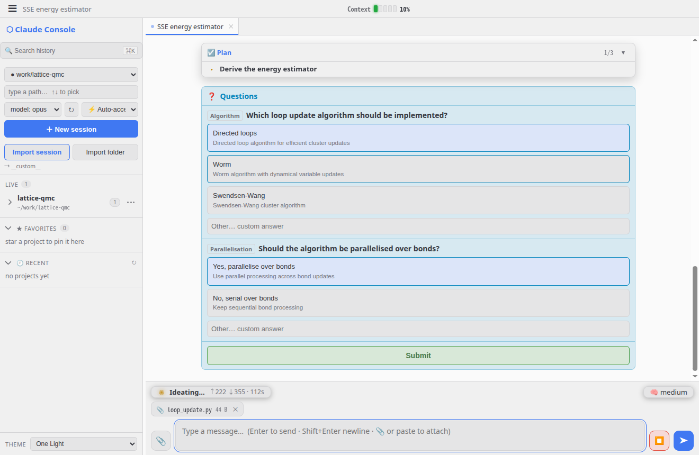

# Claude Console

[English](README.md) | 简体中文

**Claude Code** 的交互式浏览器 GUI，把裸终端里搅在一起的两样东西拆开：

- **对话** —— 你问了什么、agent 说了什么（只有正文）
- **代码与文件变更** —— 每一次工具调用（编辑、写入、命令）都渲染成
  **折叠卡片**（`✏️ Edit observables.py  +12 −3`），按需展开；外加工作目录的
  实时 `git diff`（事实依据）

<p align="center">
  
  
</p>
<p align="center">
  <sub>左：回答向下滚动时 plan 始终钉在上方；公式由 KaTeX 渲染，文件路径变成链接，
  点击可在 web file manager 中打开。右：agent 反过来问<em>你</em>问题，plan 已折叠到
  只剩当前任务，下一条消息里附着一个文件。均为 One Light 主题。</sub>
</p>

它通过 **Claude Agent SDK** 驱动 Claude Code（SDK 以 headless stream-json 模式
运行真正的 `claude` CLI），每个对话保持一个进程常驻，把你的消息喂到 stdin，再把
类型化的事件流渲染回来 —— 一个 Claude Code 风格的对话界面，代码和交谈在视觉上
始终分离，这正是它存在的理由。

## 功能

### 看清它在做什么

- **对话 / 代码分离** —— 正文进入信息流，工具调用变成可折叠的变更卡片。在任一
  编辑上点 **see Changes** 会打开抽屉并聚焦到*那一个文件*，或切到 **Git diff**
  标签页查看整个工作区。
- **流式回答** —— 回复边写边显示。CLI 是成串爆发式输出的，所以文本经过一个小的
  抖动缓冲后以匀速播出，而不是一次蹦出一句半；格式和公式只在整块完成时排版一次，
  句子中途不会重排。
- **工具调用折叠** —— 连续调用*同一个*工具会合并成一行
  （`▶ Bash ×5  ruff check .  1 failed`），展开即可看到各张卡片。中间只要插入
  任何别的东西 —— 一段回答、一次编辑、一次审批 —— 这一串就结束。
- **Plan 悬停区** —— 当 Claude 维护任务列表时，它会钉在对话上方，显示当前步骤、
  进度计数，并可折叠到只剩当前任务。最后一项任务完成几秒后它自行退场。
- **LaTeX 渲染** —— 回复中的 `$…$`、`$$…$$`、`\(…\)`、`\[…\]` 由 KaTeX 渲染
  （已内置，离线可用）。
- **可点击的文件路径** —— 回复里的路径（`~/work/lattice-qmc/observables.py`）
  会渲染成链接，点击后**在 web file manager 中新标签页打开那个文件**，让你不必
  离开对话就能看到 agent 在说什么。用 `CLAUDE_CONSOLE_WEBFM_URL` 指向你自己的那个
  （默认是本机 `:7701`）；指向本地路径的 markdown 链接同理。

### 跨 session 工作

- **Session 标签页** —— 你打开着的 session，列在对话上方。切换是交换而不是重载：
  已渲染的视图被保留，服务端只发送你离开期间发生的事。**关闭标签页永远不会结束
  session** —— 侧栏的 LIVE 列表是正在运行的，标签页是你打开着的。
- **多 session 侧栏** —— 项目按文件夹分组，含 Live / Favorites / Recent /
  In-folder 几栏（各自可折叠）。项目自己的按钮可在该处新建 session、浏览文件夹、
  收藏或重命名，也可打开 **Manage sessions** 一次清理多个；session 的 `⋮` 覆盖
  配置、重命名、导出和结束（对于磁盘上的记录还可删除到回收站）。拖右边缘调整宽度，
  双击复位。
- **可恢复的 session** —— 重新打开一个项目，接着之前的 Claude Code 对话继续
  （`~/.claude/projects` 下的记录会还原历史和正确的 `cwd`）。
- **全文历史搜索**（`⌘/Ctrl+K`）—— 搜索你和 Claude 说过的一切，以及它碰过的文件
  和命令，范围可限定为全部历史 / 当前文件夹 / 当前对话。结果在只读查看器中打开，
  所以查东西永远不会打扰你正待着的那个 session。
- **导出 / 导入** —— 把对话以 `.jsonl` 带到另一台机器，或在这里接收一个；
  **Import folder** 可以在一个目录尚无任何历史时就把它固定为项目。
- **Session recap** —— 回到一个闲置已久的 session，它会以一段简短摘要开场，告诉你
  上次停在哪里。
- **按 session 的草稿** —— 打了一半的消息跟着它所属的 session，刷新页面也不丢。

### 与它交谈

- **交互式往返** —— 在 🔐 Approve 模式下逐操作审批，三个选项
  （**Approve** / **Approve & don't ask again this session** / **Deny**），
  外加浏览器内的 **AskUserQuestion** 卡片；你的选择会回传给 agent。
- **消息队列** —— agent 忙时照打，消息进入队列，当前 turn 结束后自动发出。点击排队
  的小条（或按 ↑）可把它撤回编辑器，或点它的 **⚡** 把它插进*正在运行*的 turn。
  插入是逐条选择、默认不开的，因为 CLI 会把 turn 中途的消息作为"提醒它继续手头工作"
  呈现给模型 —— 消息一定送达，但不保证有可见的回复。
- **附件** —— 输入框里的 📎，或拖放，或粘贴。图片作为多模态块发送；其他文件会
  **保存到该 session 的工作目录**并在消息中写明文件名，于是 Claude 可以读它、改它、
  *运行*它，而不只是看一眼。手机上也能用，而粘贴在手机上根本无从下手。
- **语音输入** —— 📎 旁边的 🎙 按钮（或 **Alt+M**）开始录音，在*你自己*的机器上用
  [faster-whisper](https://github.com/SYSTRAN/faster-whisper) 实时转写。按下麦克风即
  预热模型；已确认的词语和标点保持不变，最近 10 个中文字符仍可修正，停止后会用完整
  录音再跑一遍，校正其中尚未确认的部分。它绝不自动发送，文字也始终回到发起录音的那个
  session。
- **标点来自你真实的停顿** —— 语音模型吐回来的是一堵词墙，中文几乎没法读，英文读着
  也累。静音时长会对照词级时间戳来度量，并转成标点：半秒是逗号，超过一秒是句号，
  句末若措辞在发问则补问号（`是否…`、`…吗`、`what/why/how…`）。两个阈值都由你设定，
  因为逗号该落在哪里是耳朵的事。
- **中文输出为简体** —— 可选地用 OpenCC 规范化，它转换的是词汇而不只是字形
  （`軟體` → `软件`，`記憶體` → `内存`），所以台湾口音的口述不会在文中留下台湾用语。
- **模型** —— 一个 `🤖` 药丸显示当前 session 的模型，点一下即可切换（下一轮生效，
  不重启）。只想让某一条消息用别的模型，就以 `@haiku …`、`@sonnet …`、`@opus …` 或
  `@fable …` 开头（模型 id 的任意片段都行）：这一轮用该模型，有长窗口 `[1m]` 变体的
  直接用长窗口，结束后自动切回。完整 id 按原样使用，所以 `@claude-sonnet-5` 就是要
  普通窗口。输入 `@` 会弹出补全列表，标明每个写法解析到哪个模型（↑/↓ 选择，Tab 或
  Enter 填入，Esc 关闭）。简单任务不必付 Fable 的价钱，也不用记着切回来。`@` 后面不是模型名
  的，原样作为文本发送，并给出提示。
- **思考深度** —— 一个 `🧠` 药丸（low / medium / high / xhigh / max）用于设定推理
  深度，可随时切换（`/effort` 直接发给运行中的 session，不重启）。
- 新建 session 时可选择**项目目录**、**模型**（`↻` 从 API 刷新列表）和**权限模式**
  （⚡ Auto-accept / 🔐 Approve / 📋 Plan / ⏩ Full auto），之后也可按 session 修改。

### 其他

- **13 种配色主题** —— 明暗皆有（Dark、Dracula、Nord、Tokyo Night、Catppuccin、
  Gruvbox、Light、Solarized Light、Rosé Pine Dawn、One Light、Ayu Light…），
  从侧栏切换；选择按设备保存。
- **一眼可见的状态** —— 头部有上下文窗口和 5 小时滚动用量计量；全宽输入框上方有一个
  浮动状态药丸（ready / 工作计时 / 实时 token 计数）以及模型和思考深度药丸。

## 运行

```bash
# any python with tornado + claude-agent-sdk works; defaults to localhost-only (safe):
python claude_console.py

# to reach it from your phone/iPad on the LAN, expose it WITH auth:
CLAUDE_CONSOLE_BIND=0.0.0.0 CLAUDE_CONSOLE_AUTH=me:secret python claude_console.py
```

打开 `http://<host>:7703`，选一个项目目录，开始对话；agent 干活时变更卡片和
**Git diff** 抽屉会实时更新。

语音输入是可选的，默认关闭。要打开它，请在*某个* Python 中安装 `faster-whisper`
（如果需要中文字形转换，再装 `opencc`）—— 那不必是运行 console 的那个 Python ——
然后让 `CLAUDE_CONSOLE_TRANSCRIBE_PYTHON` 指向它：

```bash
CLAUDE_CONSOLE_TRANSCRIBE=1 \
CLAUDE_CONSOLE_TRANSCRIBE_PYTHON=/path/to/whisper-env/bin/python \
CLAUDE_CONSOLE_TRANSCRIBE_MODEL=~/models/faster-whisper-large-v3-turbo \
CLAUDE_CONSOLE_TRANSCRIBE_DEVICE=cuda CLAUDE_CONSOLE_TRANSCRIBE_COMPUTE_TYPE=float16 \
CLAUDE_CONSOLE_TRANSCRIBE_PAUSE_PUNCTUATION=1 \
CLAUDE_CONSOLE_TRANSCRIBE_CHINESE_CONVERSION=tw2sp \
python claude_console.py
```

`PAUSE_PUNCTUATION` 和 `CHINESE_CONVERSION` 默认都是关的，而两个都值得打开。少了
前者，一整段口述会变成一串不断句的词。

浏览器只在安全上下文中开放麦克风，所以除非你在 `localhost` 上访问，否则请让 console
走 HTTPS（反向代理，或 `tailscale serve`）。

| Env | Default | Meaning |
|---|---|---|
| `CLAUDE_CONSOLE_PORT` | `7703` | 监听端口 |
| `CLAUDE_CONSOLE_BIND` | `127.0.0.1` | 绑定地址；设为 `0.0.0.0` 可从局域网访问 |
| `CLAUDE_CONSOLE_AUTH` | *(disabled)* | 可选的 HTTP Basic Auth `user:pass` |
| `CLAUDE_CONSOLE_WEBFM_URL` | this host on `:7701` | 打开被点击文件路径所用的 web file manager |
| `CLAUDE_CONSOLE_TRANSCRIBE` | `0` | 启用本地语音输入 |
| `CLAUDE_CONSOLE_TRANSCRIBE_PYTHON` | current python | 装有 `faster-whisper` 的解释器 |
| `CLAUDE_CONSOLE_TRANSCRIBE_MODEL` | *(unset)* | CTranslate2 模型目录，或待下载的模型名 |
| `CLAUDE_CONSOLE_TRANSCRIBE_DEVICE` | `auto` | `cpu` / `cuda` |
| `CLAUDE_CONSOLE_TRANSCRIBE_DEVICE_INDEX` | `0` | 用哪块 GPU |
| `CLAUDE_CONSOLE_TRANSCRIBE_COMPUTE_TYPE` | `default` | 例如 `float16`、`int8` |
| `CLAUDE_CONSOLE_TRANSCRIBE_LANGUAGE` | *(auto-detect)* | 固定口述语言 |
| `CLAUDE_CONSOLE_TRANSCRIBE_CHINESE_CONVERSION` | `none` | OpenCC：`t2s` 转字形，`tw2sp` 连台湾用语一起转 |
| `CLAUDE_CONSOLE_TRANSCRIBE_PAUSE_PUNCTUATION` | `0` | 依据停顿加标点，并补上句末标点 |
| `CLAUDE_CONSOLE_TRANSCRIBE_COMMA_GAP` | `0.5` | 读作逗号的静音时长（秒） |
| `CLAUDE_CONSOLE_TRANSCRIBE_PERIOD_GAP` | `1.2` | 读作句号的静音时长（秒） |
| `CLAUDE_CONSOLE_TRANSCRIBE_LD_LIBRARY_PATH` | *(unset)* | worker 额外的 CUDA 库目录 |
| `CLAUDE_CONSOLE_TRANSCRIBE_MAX_MB` | `16` | 音频上传大小上限 |
| `CLAUDE_CONSOLE_TRANSCRIBE_MAX_SEC` | `120` | 录音时长上限 |
| `CLAUDE_CONSOLE_TRANSCRIBE_TIMEOUT_SEC` | `180` | 超过此时长即放弃转写 |
| `CLAUDE_CONSOLE_TRANSCRIBE_IDLE_SEC` | `600` | worker 闲置此时长后退出，释放模型占用的内存 |

旧的 `AGENTLENS_*` 名称仍作为回退被识别。

> [!WARNING]
> 它会在你选定的目录里**驱动 Claude Code** —— 可以在那里读写文件、执行命令 ——
> 并且会暴露你的**对话历史和源码 diff**。不要在不受信任的网络上暴露它，除非配了
> `CLAUDE_CONSOLE_AUTH` 并有可信边界（VPN / SSH 隧道 / 反向代理 + TLS）。

## 说明

- 刻意做成单个 `claude_console.py`，HTML/CSS/JS 全部内联 —— **无需构建步骤**。
  唯一的例外是 `faster_whisper_worker.py`，因为语音模型想要的 Python 与 console
  运行所在的不是同一个，而且独立进程也正是模型内存得以释放的方式 —— 它闲置后
  会自行退出。
- [KaTeX](https://katex.org/) 已内置于 `static/katex/`（MIT），用于离线渲染公式。
- 非图片附件会写入 session 工作目录下的 `.claude-console/uploads/`，以便 agent
  打开并运行它们。该文件夹在 git 中自我忽略（它自带一个内容为 `*` 的 `.gitignore`），
  而排队消息若在发送前被你撤回，则不会写入任何东西。
- 每次实时预览和最终校正都使用 `0600` 权限的临时文件，请求结束即删除，失败时同样
  删除。转写文本只有在你发送自己编辑过的草稿时才会到达 Claude。
- 语音图标来自 Microsoft 的 [Fluent Emoji](https://github.com/microsoft/fluentui-emoji)
  （MIT），位于 `static/icons/`。
- 很长的对话在每个标签页只保留有限窗口的*已渲染*消息；更早的会折叠成一个标记，
  链接到历史搜索。没有任何东西被删除 —— 完整记录仍在磁盘上的 `~/.claude/projects`。

## 许可证

[MIT](LICENSE) © 2026 BoZhen
